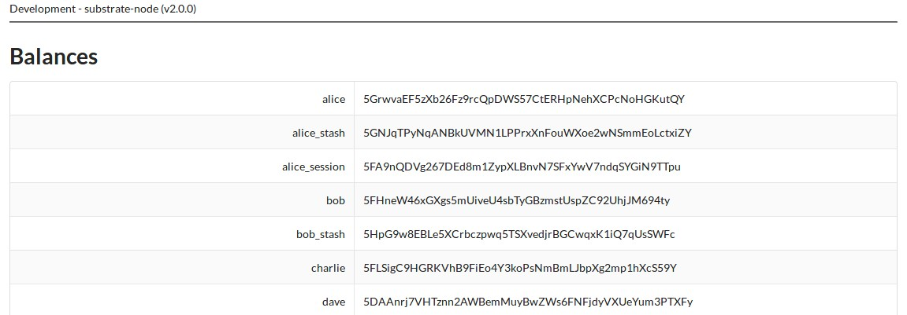
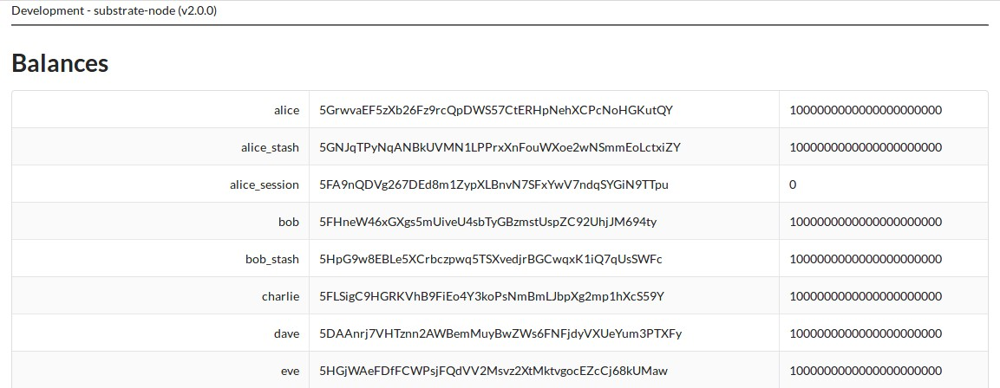

Now that we have the connection to our node let's play with some accounts. Because we are connecting to a `--dev` node, we can get access to accounts that are pre-funded, and which private key is known to us. Acount are organised in so called keyring. From a keyring you can get the address of an account, its associated name, the Keypair if this account is managed locally.. The [`@polkadot/ui-keyring`](https://polkadot.js.org/ui/ui-keyring/) package contains many utilities to manage accounts, we will make use of them in the following sections.

We needed to add `@polkadot/keyring`, `@polkadot/ui-identicon`, `@polkadot/ui-keyring`

## 2.1 Get testing accounts

First things first, let's import the `keyring` object;

```js
import keyring from '@polkadot/ui-keyring';
```

Initializing this keyring is super simple, all we need to do it call `loadAll`, to get access to the testing accout we can simply passe the object `{isDevelopment: true}` as parameter. We will add a new `useEffect` function to initialize our keyring. Let's `console.log` it to inspect what it gives us.

This is the code we added:
```js
  useEffect(() => { 
    keyring.loadAll({
      isDevelopment: true
    });
    
    console.log(keyring);
  },[]); 
```

And this is what you should get in the console:
```
{…}
​_accounts: Object { add: add(), remove: remove(), subject: {…} }
​_addresses: Object { add: add(), remove: remove(), subject: {…} }
​_contracts: Object { add: add(), remove: remove(), subject: {…} }
​_genesisHash: undefined
​_keyring: Object { _pairs: {…}, _type: "ed25519", decodeAddress: decode(), … }
​_prefix: undefined
​_store: Object {  }
​decodeAddress: function decodeAddress()​
encodeAddress: function encodeAddress()​
stores: Object { address: address(), contract: contract(), account: account() }
```

If you developp the `_keyring` and `_pairs` objects, you'll see that we have some key pairs here. Those are the testing accounts that were initialized that to the `isDevelopment` flag. Let's pass this keyring object to a Balances component so that we can display those accounts. Let's also pass the `api` as we will use it right after.

```js
// at the top of the file
import Balances from './Balances';

// in the return, after NodeInfo
<Balances
  api={api}
  keyring={keyring}
/>
```

This Balances component will very soon show all our accounts with the amount of funds. Let's start by listing the account names and their address.
Nothing fancy here other than what we talked about before, `getPairs()` will give us the array of the accounts in our keyring. Mapping through this array lets us display the name and address of each of our accounts.

```js
import React from 'react';
import { Table } from 'semantic-ui-react';

export default function Balances (props) {
  const { keyring } = props;
  const accounts = keyring.getPairs();

  return (
    <>
      <h1>Balances</h1>
      <Table celled striped>
        <Table.Body>
          {accounts.map((account, index) => {
            return (
              <Table.Row key={index}>
                <Table.Cell textAlign='right'>{account.meta.name}</Table.Cell>
                <Table.Cell>{account.address}</Table.Cell>
              </Table.Row>
            );
          })}
        </Table.Body>
      </Table>
    </>
  );
}
```

You can get the working version of this code by visiting `part-2-1` directory:

```bash
cd part-2-1;
yarn;
yarn start;
```

If you run this example, you will get a table with "Alice", "Alice_stash", "Bob".. and their address.


## 2.2 Query and display Alice's balance

Now that we have our accounts, we can query the balance from each. The substrate node that you connect to has a `Balances` [srml module](https://substrate.dev/rustdocs/v1.0/srml_balances/index.html) that keeps track of the balance of each account on the blockchain. What we will watch is the `freeBalance` of an account. The [Polkadot-js api](https://polkadot.js.org/api/api/) allows you to query the storage from an srml modules with `api.query`. This is how we can get access to this `freeBalance` information.

It is worth mentionning that the funds in `freeBalancee` of an account might **not** be available to transfer. An account could very well have funds, but if those are staked (for validating) you might not be able to transfer them although `freeBalance` is not null. If you want to show the balance available to transfer, this is computed in a so called derive `api`, have a look at the `available` field returned by [`derive.balances.all`](https://github.com/polkadot-js/api/blob/master/packages/api-derive/src/balances/all.ts).

Back to our let's start small and query the balance for one account, Alice.

```js
export default function Balances (props) {
  const { api, keyring } = props;
  const accounts = keyring.getPairs();
  // this state will keep track of Alice's freeBalance
  const [balance, setBalance] = useState('0');

  useEffect(() => {
    let unsubscribe;

    api.query.balances.freeBalance(accounts[0].address, (currentBalance) => {
        setBalance(currentBalance.toString());
      })
      .then(unsub => { unsubscribe = unsub; })
      .catch(console.error);

    return () => unsubscribe && unsubscribe();
  }, [accounts, api.query.balances, api.query.balances.freeBalance]);
```

We start by creating a `balance` state, that we will initialize at `0`. Then, as we did in the previous part, we will make the query in a React hook, with `useEffect`. However we will want to display if the balance changes, this `api.query.balances.freeBalance` takes as first argument the account's address you want to request, and you can pass a callbacl as second argument. This callback receives the current balance for the given account. This is where we will perssist it in the state.

This `query` is a subscription to the storage, this is what will allow us to see the balance change without reloading the page! Because it's a subscription, we must unsubscribe whenever our `Balances` React component unmounts. The `unsubscribe` function is what is actually returned by the `query`. This one must be called in the `return` statement of the `useEffect` that will be called whenever the component unmounts, in our case it's when we close the tab or refresh out app's page manually.

Let's strip down the table we return to only show Alice and the account's associated balance.

 ```js
  return (
    <>
      <h1>Balances</h1>
      <Table celled striped>
        <Table.Body>
          <Table.Row key={0}>
            <Table.Cell textAlign='right'>{accounts[0].meta.name}</Table.Cell>
            <Table.Cell>{accounts[0].address}</Table.Cell>
            <Table.Cell>{balance}</Table.Cell>
          </Table.Row>
        </Table.Body>
      </Table>
    </>
  );
}
 ```

You can get the working version of this code by visiting `part-2-2` directory:

```bash
cd part-2-2;
yarn;
yarn start;
```

If you run this example, you will get a table with "Alice" account and balance.


## 2.3 Query and display all balances

Now that we know how querying the state of a module works, we can map through all of our accounts and query the state for each one. The `api` has a handy function to batch multiple queries at the same time, it's called `multi`. You can pass an array of arguments and it will return an array of result.

Instead of having just the balance of Alice in the state, we will change it an object mapping `address` with `freeBalance` so that we can use it to display each account's balance. Because the `multi` remains one subscription, the logic for unsubscribing remains the same.

```js
const { api, keyring } = props;
const accounts = keyring.getPairs();
const addresses = accounts.map(account => account.address);
const accountNames = accounts.map((account) => account.meta.name);
const [balances, setBalances] = useState({});

useEffect(() => {
  let unsubscribeAll

  api.query.balances.freeBalance
    .multi(addresses, (currentBalances) => {
      const balancesMap = addresses.reduce((acc, address, index) => ({
        ...acc,
        [address]: currentBalances[index].toString()
      }), {});
      setBalances(balancesMap);
    })
    .then(unsub => { unsubscribeAll = unsub; })
    .catch(console.error);

  return () => unsubscribeAll && unsubscribeAll();
}, [addresses, api.query.balances.freeBalance, setBalances]);
```

We call `api.query.balances.freeBalance.multi` and pass our array of addresses, the callback then received an array of results. From there we create with `reduce` an object with the address and balance of each account, this is what we will persist in the state.

Displaying the accounts with their balance is now easy, we will go through our list of addresses and display the names and balances. 

```js
  return (
    <>
      <h1>Balances</h1>
      <Table celled striped>
        <Table.Body>
          {addresses.map((address, index) => {
            return (
              <Table.Row key={index}>
                <Table.Cell textAlign='right'>{accountNames[index]}</Table.Cell>
                <Table.Cell>{address}</Table.Cell>
                <Table.Cell>{balances && balances[address]}</Table.Cell>
              </Table.Row>
            );
          })}
        </Table.Body>
      </Table>
    </>
  );
```
You can get the working version of this code by visiting `part-2-3` directory:

```bash
cd part-2-3;
yarn;
yarn start;
```

If you run this example, you will get a table with all our testing accounts and their address and their balance.


[Part 3 - Transfer funds ->](part-3-transfer-funds.md)